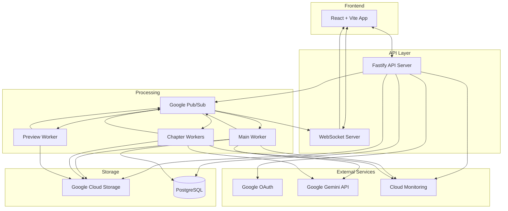

# Bookomol Architecture Plan

## Project Overview
Bookomol is a web application that enables users to upload PDF books and create condensed versions using AI/LLM technology. The system processes books by splitting them into chapters, analyzing content, and generating compressed versions while preserving essential information like code examples and diagrams.

## Core Requirements Summary

### Book Processing
- **Compression Ratio**: 10:1 default (configurable per upload)
- **Condensing Levels**:
  - Light: 30% reduction
  - Medium: 50% reduction  
  - Heavy: 70% reduction
- **Content Preservation**: All code examples and diagrams retained
- **Chapter Processing**: Auto-skip intro/acknowledgment chapters via LLM

### User Features
- Google authentication
- Library view with uploaded books
- Upload PDF with condensing settings
- Preview original and condensed PDFs
- Download condensed PDFs
- Real-time processing progress via WebSocket
- Daily quota: 3 books (freemium tier)

## System Architecture

### High-Level Architecture Diagram



### Component Details

#### 1. Frontend (React + Vite)
- **Technology Stack**:
  - React 18 with TypeScript
  - Vite for build tooling
  - Material UI component library
  - React Router for navigation
  - React Query for data fetching
  - React Hook Form for forms
  - React Dropzone for uploads
  - React PDF for previews
  - Socket.io client for real-time updates

- **Key Features**:
  - Responsive design with dark/light themes
  - Google OAuth integration
  - Real-time progress tracking
  - PDF preview capabilities

#### 2. API Server (Fastify)
- **Technology Stack**:
  - Node.js with TypeScript
  - Fastify web framework
  - Passport.js for authentication
  - Prisma ORM for database
  - Socket.io for WebSocket

- **API Endpoints**:
  ```
  Authentication:
  GET  /auth/google
  GET  /auth/google/callback
  POST /auth/logout
  
  User:
  GET  /api/user/profile
  GET  /api/user/usage
  
  Books:
  GET  /api/books (list user's books)
  POST /api/books/upload/url (get presigned URL)
  POST /api/books (create book record)
  GET  /api/books/:id
  GET  /api/books/:id/download/original
  GET  /api/books/:id/download/condensed
  DELETE /api/books/:id
  
  Processing:
  GET  /api/books/:id/status
  POST /api/books/:id/process
  ```

#### 3. Database Schema (PostgreSQL)

```sql
-- Users table
CREATE TABLE users (
    id UUID PRIMARY KEY DEFAULT gen_random_uuid(),
    google_id VARCHAR(255) UNIQUE NOT NULL,
    email VARCHAR(255) UNIQUE NOT NULL,
    name VARCHAR(255),
    avatar_url TEXT,
    daily_usage_count INTEGER DEFAULT 0,
    daily_usage_reset_at TIMESTAMP,
    total_api_cost DECIMAL(10,2) DEFAULT 0,
    created_at TIMESTAMP DEFAULT NOW(),
    updated_at TIMESTAMP DEFAULT NOW()
);

-- Books table
CREATE TABLE books (
    id UUID PRIMARY KEY DEFAULT gen_random_uuid(),
    user_id UUID REFERENCES users(id),
    title VARCHAR(500),
    original_filename VARCHAR(500),
    original_url TEXT,
    condensed_url TEXT,
    preview_url TEXT,
    original_pages INTEGER,
    condensed_pages INTEGER,
    condensing_level VARCHAR(20), -- light/medium/heavy
    compression_ratio DECIMAL(4,2),
    status VARCHAR(50), -- uploaded/processing/completed/failed
    processing_progress INTEGER DEFAULT 0,
    error_message TEXT,
    api_cost DECIMAL(10,2) DEFAULT 0,
    created_at TIMESTAMP DEFAULT NOW(),
    updated_at TIMESTAMP DEFAULT NOW()
);

-- Chapters table
CREATE TABLE chapters (
    id UUID PRIMARY KEY DEFAULT gen_random_uuid(),
    book_id UUID REFERENCES books(id),
    chapter_number INTEGER,
    title VARCHAR(500),
    original_url TEXT,
    condensed_url TEXT,
    original_pages INTEGER,
    condensed_pages INTEGER,
    status VARCHAR(50), -- pending/processing/completed/failed/skipped
    created_at TIMESTAMP DEFAULT NOW(),
    updated_at TIMESTAMP DEFAULT NOW()
);

-- Processing jobs table
CREATE TABLE processing_jobs (
    id UUID PRIMARY KEY DEFAULT gen_random_uuid(),
    book_id UUID REFERENCES books(id),
    job_type VARCHAR(50), -- split/condense/preview/combine
    status VARCHAR(50),
    message TEXT,
    created_at TIMESTAMP DEFAULT NOW(),
    updated_at TIMESTAMP DEFAULT NOW()
);
```

#### 4. Background Workers

##### Main Worker (Orchestrator)
- Triggered when book upload completes
- Downloads PDF from GCS
- Sends PDF to Gemini API for chapter detection
- Creates chapter records in database
- Publishes chapter processing tasks to Pub/Sub
- Monitors chapter completion
- Combines condensed chapters into final PDF
- Updates book status and sends completion notification

##### Chapter Workers
- Process individual chapter condensing tasks
- Send chapter to Gemini API with appropriate prompt
- Save condensed chapter to GCS
- Publish completion event

##### Preview Worker
- Generates preview images for PDFs
- Runs independently from main processing
- Creates thumbnail and preview pages
- Stores in GCS

#### 5. Message Queue Structure (Pub/Sub)

Topics:
- `book-uploaded`: New book ready for processing
- `chapter-ready`: Chapter ready for condensing
- `chapter-completed`: Chapter processing done
- `book-completed`: All chapters done
- `preview-generate`: Generate preview images
- `progress-update`: Send to WebSocket

Message Examples:
```json
// book-uploaded
{
  "bookId": "uuid",
  "userId": "uuid",
  "condensingLevel": "medium",
  "originalUrl": "gs://bucket/path"
}

// chapter-ready
{
  "bookId": "uuid",
  "chapterId": "uuid",
  "chapterNumber": 3,
  "chapterUrl": "gs://bucket/path"
}

// progress-update
{
  "bookId": "uuid",
  "userId": "uuid",
  "progress": 45,
  "status": "processing",
  "message": "Processing chapter 5 of 11"
}
```

## Infrastructure Setup

### Google Cloud Services
1. **Cloud Run**: Host API server, workers
2. **Cloud Storage**: Store PDFs (original, chapters, condensed)
3. **Cloud SQL**: PostgreSQL database
4. **Pub/Sub**: Message queue
5. **Cloud Monitoring**: Logs and metrics
6. **Cloud CDN**: Serve static assets

### Storage Structure
```
bookomol-storage/
├── books/
│   ├── {userId}/
│   │   ├── {bookId}/
│   │   │   ├── original.pdf
│   │   │   ├── condensed.pdf
│   │   │   ├── preview/
│   │   │   │   ├── thumbnail.png
│   │   │   │   └── pages/
│   │   │   └── chapters/
│   │   │       ├── original/
│   │   │       │   ├── chapter-1.pdf
│   │   │       │   └── chapter-2.pdf
│   │   │       └── condensed/
│   │   │           ├── chapter-1.pdf
│   │   │           └── chapter-2.pdf
```

## LLM Integration Strategy

### Prompts Structure

#### Chapter Detection Prompt
```
You are analyzing a PDF book. Extract the table of contents and identify all chapters.
Skip introductory content like preface, acknowledgments, about the author.
Return a JSON array with chapter information.

Format:
[
  {
    "number": 1,
    "title": "Chapter Title",
    "startPage": 15,
    "endPage": 45,
    "shouldProcess": true
  }
]
```

#### Condensing Prompts

Light (30% reduction):
```
Condense this chapter to 70% of its original length.
Preserve ALL code examples, diagrams, tables, and formulas.
Focus on removing redundant explanations and verbose descriptions.
Maintain technical accuracy and key concepts.
```

Medium (50% reduction):
```
Condense this chapter to 50% of its original length.
Preserve ALL code examples and critical diagrams.
Summarize explanations to key points.
Remove examples that don't add unique value.
Keep the learning progression intact.
```

Heavy (70% reduction):
```
Condense this chapter to 30% of its original length.
Keep only essential code examples and diagrams.
Focus on core concepts and actionable knowledge.
Create a reference-style summary.
Remove all redundancy and verbose content.
```

## Development Environment

### Docker Compose Setup
```yaml
version: '3.8'

services:
  postgres:
    image: postgres:15
    environment:
      POSTGRES_DB: bookomol
      POSTGRES_USER: bookomol
      POSTGRES_PASSWORD: localpass
    ports:
      - "5432:5432"
    volumes:
      - postgres_data:/var/lib/postgresql/data

  redis:
    image: redis:7
    ports:
      - "6379:6379"
    volumes:
      - redis_data:/data

  minio:
    image: minio/minio
    command: server /data --console-address ":9001"
    ports:
      - "9000:9000"
      - "9001:9001"
    environment:
      MINIO_ROOT_USER: minioadmin
      MINIO_ROOT_PASSWORD: minioadmin
    volumes:
      - minio_data:/data

  pubsub-emulator:
    image: gcr.io/google.com/cloudsdktool/cloud-sdk
    command: gcloud beta emulators pubsub start --host-port=0.0.0.0:8085
    ports:
      - "8085:8085"

volumes:
  postgres_data:
  redis_data:
  minio_data:
```

## Monitoring and Observability

### Metrics to Track
- Book processing times
- Chapter processing times
- LLM API response times
- Daily usage per user
- API costs per operation
- Error rates by component  
- Queue depths and processing delays

### Logging Strategy
- Structured JSON logging
- Correlation IDs for request tracking
- Log levels: ERROR, WARN, INFO, DEBUG
- Integration with Google Cloud Logging

## Security Considerations

1. **Authentication**: Google OAuth 2.0
2. **Authorization**: JWT tokens with user claims
3. **File Access**: Presigned URLs with expiration
4. **Rate Limiting**: 3 books/day per user
5. **Input Validation**: File type and size limits
6. **API Security**: CORS, HTTPS only
7. **Secrets Management**: Google Secret Manager

## Deployment Pipeline

### GitHub Actions Workflow
1. Run tests and linting
2. Build Docker images
3. Push to Google Container Registry
4. Deploy to Cloud Run
5. Run smoke tests
6. Update monitoring dashboards

## Scalability Considerations

1. **Horizontal Scaling**: Cloud Run auto-scaling for API and workers
2. **Queue Management**: Multiple workers for chapter processing
3. **CDN**: Static assets and preview images
4. **Database**: Connection pooling and read replicas if needed

## Cost Optimization

1. **Storage Lifecycle**: Archive old books after 6 months  
2. **Compute**: Use Cloud Run minimum instances wisely
3. **Monitoring**: Set up cost alerts and budgets
4. **API Calls**: Track Gemini API usage per user

## Future Enhancements

1. **Billing System**: Stripe integration for premium tiers
2. **Advanced Features**:
   - Batch processing
   - Custom prompts
   - Multiple LLM providers
   - OCR for scanned PDFs
3. **Analytics**: User behavior and processing statistics
4. **Mobile Apps**: iOS and Android clients