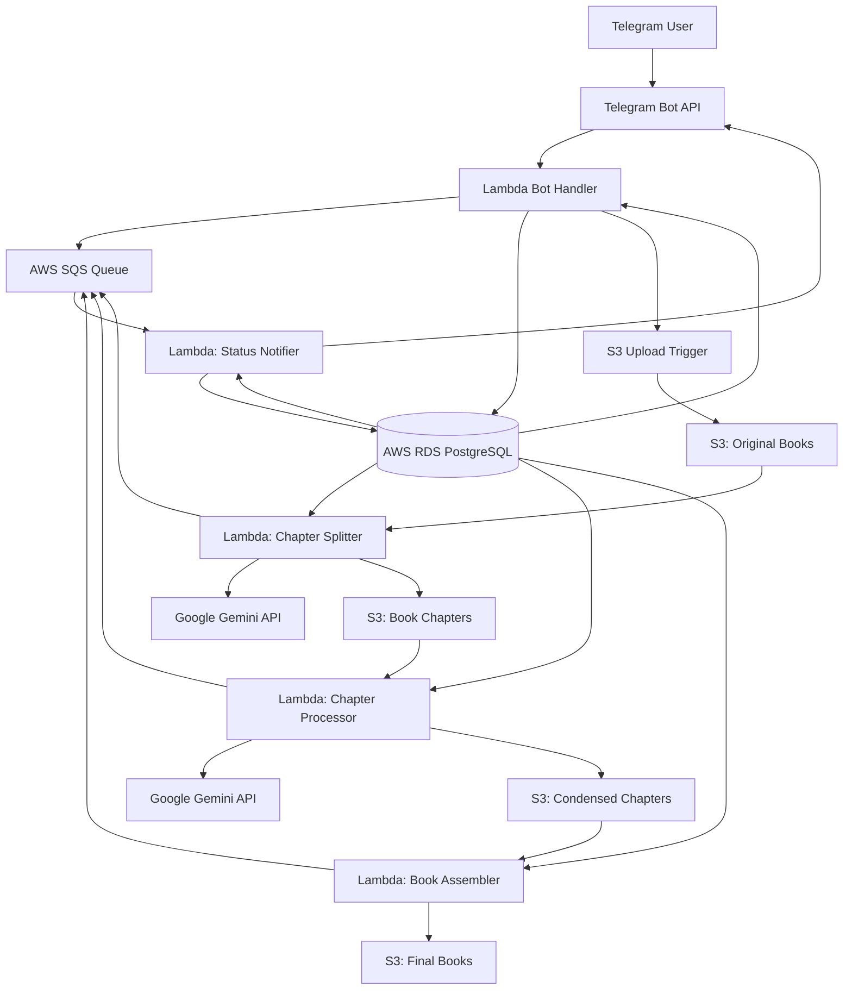

# Bookomol - PDF Book Condensing Telegram Bot

## Architectural Plan

### 1. Executive Summary

Bookomol is a serverless Telegram bot application that leverages AI to condense PDF books into more digestible formats. The system uses AWS Lambda for compute, S3 for storage, and Google Gemini API for AI-powered content analysis and summarization. The architecture is designed for scalability, cost-effectiveness, and ease of maintenance.

### 2. System Architecture Overview



### 3. Component Architecture

#### 3.1 Telegram Bot Service

- **Technology**: Node.js with Grammy framework [https://grammy.dev](https://grammy.dev)
- **Deployment**: AWS Lambda with API Gateway
- **Memory**: 512MB
- **Timeout**: 30 seconds
- **Responsibilities**:
  - Handle user commands and interactions
  - Manage conversation flow and user sessions
  - Generate presigned URLs for S3 uploads/downloads
  - Update job status in database
  - Process inline keyboard callbacks

#### 3.2 Processing Pipeline

##### 3.2.1 Chapter Splitter Lambda

- **Trigger**: S3 object creation event in original/ folder
- **Memory**: 3008MB (3GB)
- **Timeout**: 900 seconds (15 minutes)
- **Responsibilities**:
  - Download PDF from S3
  - Use Gemini API to identify chapter boundaries
  - Analyze table of contents and chapter structure
  - Split PDF into individual chapter files
  - Identify and mark low-value chapters for skipping
  - Store chapters in S3 chapters/ folder
  - Update job metadata in RDS
  - Send progress updates to SQS

##### 3.2.2 Chapter Processor Lambda

- **Trigger**: S3 object creation event in chapters/ folder
- **Memory**: 1024MB (1GB)
- **Timeout**: 900 seconds (15 minutes)
- **Concurrency**: 10 parallel executions (reserved)
- **Responsibilities**:
  - Process individual chapters based on condensation level
  - Skip chapters marked as low-value
  - Generate condensed content using Gemini API
  - Store condensed chapters in S3 processed/ folder
  - Track processing progress
  - Send status updates to SQS

##### 3.2.3 Book Assembler Lambda

- **Trigger**: Completion of all chapter processing
- **Memory**: 2048MB (2GB)
- **Timeout**: 600 seconds (10 minutes)
- **Responsibilities**:
  - Combine condensed chapters into final PDF
  - Generate updated table of contents
  - Apply formatting and styling
  - Add metadata (title, author, condensation level)
  - Store final book in S3 final/ folder
  - Send completion notification via SQS

##### 3.2.4 Status Notifier Lambda

- **Trigger**: SQS messages
- **Memory**: 512MB
- **Timeout**: 30 seconds
- **Responsibilities**:
  - Process status update messages from SQS
  - Send real-time progress updates to users via Telegram
  - Update job status in database
  - Handle error notifications

#### 3.3 Data Storage

##### 3.3.1 S3 Bucket Structure

```
bookomol-storage-{environment}/
├── original/
│   └── {userId}/{jobId}/{filename}.pdf
├── chapters/
│   └── {userId}/{jobId}/chapter_{number}_{title}.pdf
├── processed/
│   └── {userId}/{jobId}/condensed_chapter_{number}.pdf
└── final/
    └── {userId}/{jobId}/{condensationLevel}_{filename}.pdf
```

##### 3.3.2 Database Schema (PostgreSQL with Sequelize)

**Users Table**

```typescript
{
  id: INTEGER (Primary Key, Auto Increment)
  telegramId: BIGINT (Unique, Not Null)
  username: VARCHAR(255) (Nullable)
  firstName: VARCHAR(255) (Nullable) 
  lastName: VARCHAR(255) (Nullable)
  languageCode: VARCHAR(10) (Default: 'en')
  monthlyQuota: INTEGER (Default: 10)
  isPremium: BOOLEAN (Default: false)
  createdAt: TIMESTAMP WITH TIME ZONE
  updatedAt: TIMESTAMP WITH TIME ZONE
}
```

**Books Table**

```typescript
{
  id: INTEGER (Primary Key, Auto Increment)
  userId: INTEGER (Foreign Key → users.id)
  title: VARCHAR(500) (Not Null)
  author: VARCHAR(500) (Nullable)
  originalFilename: VARCHAR(255) (Not Null)
  originalSize: BIGINT (Not Null)
  pageCount: INTEGER (Nullable)
  uploadDate: TIMESTAMP WITH TIME ZONE
  s3Key: VARCHAR(500) (Unique, Not Null)
  createdAt: TIMESTAMP WITH TIME ZONE
  updatedAt: TIMESTAMP WITH TIME ZONE
}
```

**ProcessingJobs Table**

```typescript
{
  id: INTEGER (Primary Key, Auto Increment)
  bookId: INTEGER (Foreign Key → books.id)
  status: VARCHAR(50) (Not Null) // 'pending', 'splitting', 'processing', 'assembling', 'completed', 'failed'
  condensationLevel: VARCHAR(20) (Not Null) // 'brief', 'standard', 'comprehensive'
  totalChapters: INTEGER (Nullable)
  processedChapters: INTEGER (Default: 0)
  skippedChapters: TEXT (JSON) // Array of skipped chapter info
  startedAt: TIMESTAMP WITH TIME ZONE
  completedAt: TIMESTAMP WITH TIME ZONE
  errorMessage: TEXT (Nullable)
  finalSize: BIGINT (Nullable)
  finalS3Key: VARCHAR(500) (Nullable)
  createdAt: TIMESTAMP WITH TIME ZONE
  updatedAt: TIMESTAMP WITH TIME ZONE
}
```

**Chapters Table**

```typescript
{
  id: INTEGER (Primary Key, Auto Increment)
  jobId: INTEGER (Foreign Key → processingJobs.id)
  chapterNumber: INTEGER (Not Null)
  title: VARCHAR(500)
  originalPages: INTEGER
  condensedPages: INTEGER
  isSkipped: BOOLEAN (Default: false)
  skipReason: VARCHAR(255)
  processingTimeMs: INTEGER
  createdAt: TIMESTAMP WITH TIME ZONE
  updatedAt: TIMESTAMP WITH TIME ZONE
}
```

**UserQuota Table**

```typescript
{
  id: INTEGER (Primary Key, Auto Increment)
  userId: INTEGER (Foreign Key → users.id)
  month: VARCHAR(7) (Not Null) // Format: 'YYYY-MM'
  booksProcessed: INTEGER (Default: 0)
  createdAt: TIMESTAMP WITH TIME ZONE
  updatedAt: TIMESTAMP WITH TIME ZONE
}
```

### 4. Technology Stack

#### 4.1 Core Technologies

- **Runtime**: Node.js 20.x LTS
- **Language**: TypeScript 5.x
- **Package Manager**: npm/pnpm
- **Build Tool**: Vite

#### 4.2 AWS Services

- **Compute**: Lambda
- **Storage**: S3
- **Database**: RDS PostgreSQL 15.x
- **Queue**: SQS
- **API Gateway**: REST API for webhook endpoints
- **CloudWatch**: Logging and monitoring
- **Secrets Manager**: API keys storage
- **IAM**: Security and permissions

#### 4.3 Development Tools

- **IaC**: AWS SAM (Serverless Application Model)
- **ORM**: Sequelize v6 with sequelize-typescript decorators
- **Local Development**: Docker & Docker Compose
- **CI/CD**: GitHub Actions
- **Linting**: ESLint, Prettier

#### 4.4 Third-party Services

- **AI**: Google Gemini API (gemini-1.5-pro / gemini-1.5-flash)
- **Telegram**: Bot API via Grammy framework
- **PDF Processing**: pdf-lib, pdfjs-dist
- **Logging**: Pino

### 5. Security Architecture

#### 5.1 Authentication & Authorization

- Telegram webhook validation using secret token
- X-Telegram-Bot-Api-Secret-Token header verification
- User authentication via Telegram ID
- User quotas enforced at application level
- Premium user management via database flags

#### 5.2 Data Security

- S3 bucket encryption at rest (AES-256)
- SSL/TLS 1.2+ for all data in transit
- Presigned URLs with 1-hour expiration for file access
- S3 bucket policies blocking public access
- VPC security groups for RDS access

#### 5.3 Secrets Management

- AWS Secrets Manager for API keys
- Environment variables for Lambda configuration
- Separate secrets per environment
- No hardcoded credentials

### 6. Scalability Architecture

#### 6.1 Horizontal Scaling

- Lambda auto-scales based on demand (up to 1,000 concurrent)
- Concurrent chapter processing (10 reserved concurrent executions)
- SQS for decoupling and buffering
- Database connection pooling (20 max connections)

#### 6.2 Performance Optimization

- CloudFront CDN for final book delivery (future)
- Lambda provisioned concurrency for bot handler (future)
- S3 multipart upload for large files
- Efficient PDF processing with streaming

#### 6.3 Rate Limiting

- Telegram Bot API: 30 messages/second
- Google Gemini API: 60 requests/minute
- User quota: 10 books/month (free tier)
- Concurrent jobs: 10 per user maximum

### 7. Monitoring & Observability

#### 7.1 Logging

- Pino structured JSON logging
- CloudWatch Logs for centralization
- Log aggregation by request ID
- Sensitive data redaction

#### 7.2 Metrics (CloudWatch)

```typescript
{
  namespace: 'Bookomol',
  metrics: [
    'BookProcessingStarted',
    'BookProcessingCompleted', 
    'BookProcessingFailed',
    'ProcessingDuration',
    'ChapterProcessingTime',
    'QuotaExceeded',
    'APIErrors'
  ]
}
```

#### 7.3 Alerting

- CloudWatch Alarms for:
  - Lambda error rate > 1%
  - Lambda duration > 80% timeout
  - Queue depth > 100 messages
  - Database connection failures
  - API rate limit approaching
  - Processing failures > 5 in 5 minutes

### 8. Development Architecture

#### 8.1 Local Development Stack

```yaml
# docker-compose.yml
version: '3.8'
services:
  postgres:
    image: postgres:15
    environment:
      POSTGRES_DB: bookomol_dev
      POSTGRES_USER: bookomol
      POSTGRES_PASSWORD: dev_password
    ports:
      - "5432:5432"
    volumes:
      - postgres_data:/var/lib/postgresql/data
  
  minio:
    image: minio/minio
    command: server /data --console-address ":9001"
    ports:
      - "9000:9000"
      - "9001:9001"
    environment:
      MINIO_ROOT_USER: minioadmin
      MINIO_ROOT_PASSWORD: minioadmin
    volumes:
      - minio_data:/data
  
  localstack:
    image: localstack/localstack
    ports:
      - "4566:4566"
    environment:
      - SERVICES=sqs,secretsmanager
      - DEBUG=1
      - DATA_DIR=/tmp/localstack/data
    volumes:
      - localstack_data:/tmp/localstack
      
volumes:
  postgres_data:
  minio_data:
  localstack_data:
```

#### 8.2 Environment Configuration

```env
# .env.development
NODE_ENV=development
DB_HOST=localhost
DB_PORT=5432
DB_NAME=bookomol_dev
DB_USER=bookomol
DB_PASSWORD=dev_password

S3_ENDPOINT=http://localhost:9000
S3_BUCKET=bookomol-storage-dev
AWS_ACCESS_KEY_ID=minioadmin
AWS_SECRET_ACCESS_KEY=minioadmin

SQS_ENDPOINT=http://localhost:4566
QUEUE_URL=http://localhost:4566/000000000000/bookomol-processing-status

TELEGRAM_BOT_TOKEN=your_dev_bot_token
TELEGRAM_SECRET_TOKEN=your_webhook_secret
GEMINI_API_KEY=your_gemini_api_key
```

### 9. Deployment Architecture

#### 9.1 Infrastructure as Code - AWS SAM

AWS SAM provides the deployment framework for the entire serverless application:

- **Template**: `template.yaml` defines all AWS resources
- **Configuration**: `samconfig.toml` for deployment settings
- **Environments**: dev, prod with separate parameters

See detailed SAM implementation in the Technical Requirements document section 8.2.

#### 9.2 CI/CD Pipeline

```yaml
# .github/workflows/deploy.yml
name: Deploy to AWS

on:
  push:
    branches: [main, develop]
  pull_request:
    branches: [main]

jobs:
  test:
    runs-on: ubuntu-latest
    steps:
      - uses: actions/checkout@v3
      - uses: actions/setup-node@v3
        with:
          node-version: '20'
      - run: npm ci
      - run: npm run lint
      - run: npm run build
      
  deploy:
    needs: test
    if: github.ref == 'refs/heads/main'
    runs-on: ubuntu-latest
    steps:
      - uses: actions/checkout@v3
      - uses: actions/setup-node@v3
      - uses: aws-actions/setup-sam@v2
      - run: npm ci
      - run: npm run build
      - run: sam build
      - run: sam deploy --no-confirm-changeset
        env:
          AWS_ACCESS_KEY_ID: ${{ secrets.AWS_ACCESS_KEY_ID }}
          AWS_SECRET_ACCESS_KEY: ${{ secrets.AWS_SECRET_ACCESS_KEY }}
```

#### 9.3 Deployment Strategy

1. **Development**: Local Docker environment
2. **Production**: Full AWS deployment with monitoring

### 10. Cost Optimization

#### 10.1 Estimated Monthly Costs

Based on processing 150 books/month (35MB average):

- **Lambda Invocations**: ~$15
  - Bot Handler: 10,000 invocations
  - Chapter Splitter: 150 invocations
  - Chapter Processor: 1,500 invocations
  - Book Assembler: 150 invocations
  - Status Notifier: 3,000 invocations
  
- **Lambda Compute Time**: ~$20
  - Total: ~50,000 GB-seconds
  
- **S3 Storage & Transfer**: ~$5
  - Storage: 10GB temporary + 5GB final
  - Transfer: 5GB downloads
  
- **RDS PostgreSQL**: ~$15
  - db.t3.micro instance
  - 20GB storage
  
- **SQS**: ~$1
  - ~10,000 messages
  
- **Google Gemini API**: ~$80-120
  - ~5 million tokens processed
  
- **Total**: ~$140-180/month

#### 10.2 Cost Optimization Strategies

1. **Storage Optimization**:
   - S3 lifecycle policies (1 day for originals, 7 days for finals)
   - Compress chapters before storage
   - Delete intermediate files promptly

2. **Compute Optimization**:
   - Use Lambda ARM architecture (20% cheaper)
   - Right-size Lambda memory allocations
   - Implement caching for repeated content

3. **Database Optimization**:
   - Use RDS reserved instances (up to 72% savings)
   - Enable auto-pause for development environments
   - Optimize queries and indexes

4. **API Optimization**:
   - Cache Gemini API responses for similar content
   - Use gemini-1.5-flash for non-critical processing
   - Batch API requests where possible

### 11. Error Handling Strategy

#### 11.1 Error Codes

```typescript
export enum ErrorCode {
  // 4xx Client Errors
  INVALID_FILE_FORMAT = 'E1001',
  FILE_TOO_LARGE = 'E1002', 
  QUOTA_EXCEEDED = 'E1003',
  INVALID_COMMAND = 'E1004',
  
  // 5xx Server Errors  
  AI_API_ERROR = 'E2001',
  DATABASE_ERROR = 'E2002',
  S3_ERROR = 'E2003',
  LAMBDA_TIMEOUT = 'E2004',
  PROCESSING_FAILED = 'E2005'
}
```

#### 11.2 Error Recovery

- Automatic retry with exponential backoff
- Dead letter queues for failed messages
- Graceful degradation for API failures
- User-friendly error messages in Telegram

### 12. API Specifications

For detailed API specifications including:

- Telegram Bot Webhook API
- Internal Lambda APIs
- S3 Event Handlers
- SQS Message Formats
- Google Gemini Integration

Please refer to Section 3 of the Technical Requirements document.

### 13. Future Architecture Enhancements

#### 13.1 Phase 2 Features

- Multi-language support with translation
- Web interface for book management
- Batch processing for multiple books
- Advanced AI models (GPT-4, Claude)
- Audio book condensation

#### 13.2 Infrastructure Evolution

- Migration to ECS/Fargate for long-running tasks
- Redis cache layer for API responses
- Step Functions for complex workflows
- Data lake for analytics and ML
- Multi-region deployment for global access

### 14. Migration Path

#### 14.1 From MVP to Production

1. Implement comprehensive testing suite
2. Add monitoring and alerting
3. Enable auto-scaling policies
4. Implement backup strategies
5. Add disaster recovery plan

#### 14.2 Database Migration

1. Use Sequelize CLI for schema management
2. Version control all migrations
3. Test rollback procedures
4. Implement zero-downtime migrations
