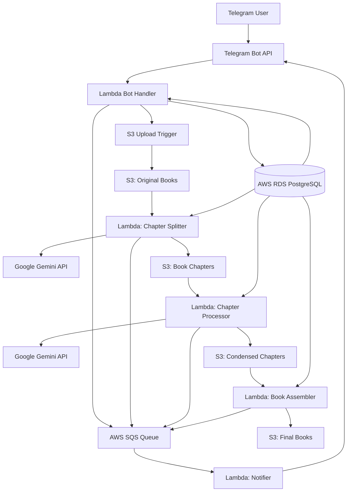

# Bookomol - PDF Book Condensing Telegram Bot
## Architectural Plan

### 1. Executive Summary

Bookomol is a serverless Telegram bot application that leverages AI to condense PDF books into more digestible formats. The system uses AWS Lambda for compute, S3 for storage, and Google Gemini API for AI-powered content analysis and summarization. The architecture is designed for scalability, cost-effectiveness, and ease of maintenance.

### 2. System Architecture Overview



### 3. Component Architecture

#### 3.1 Telegram Bot Service
- **Technology**: Node.js with Telegraf framework
- **Deployment**: AWS Lambda with API Gateway
- **Responsibilities**:
  - Handle user commands and interactions
  - Manage conversation flow and user sessions
  - Generate presigned URLs for S3 uploads/downloads
  - Update job status in database

#### 3.2 Processing Pipeline

##### 3.2.1 Chapter Splitter Lambda
- **Trigger**: S3 object creation event
- **Memory**: 3GB
- **Timeout**: 15 minutes
- **Responsibilities**:
  - Download PDF from S3
  - Use Gemini API to identify chapter boundaries
  - Split PDF into individual chapter files
  - Identify and mark low-value chapters for skipping
  - Store chapters in S3
  - Update job metadata in RDS

##### 3.2.2 Chapter Processor Lambda
- **Trigger**: S3 object creation event (chapters folder)
- **Memory**: 1GB 
- **Timeout**: 15 minutes
- **Concurrency**: 10 parallel executions
- **Responsibilities**:
  - Process individual chapters based on condensation level
  - Skip chapters marked as low-value
  - Generate condensed content using Gemini API
  - Store condensed chapters in S3
  - Report progress to SQS

##### 3.2.3 Book Assembler Lambda
- **Trigger**: Completion of all chapter processing
- **Memory**: 2GB
- **Timeout**: 10 minutes
- **Responsibilities**:
  - Combine condensed chapters into final PDF
  - Generate table of contents
  - Apply formatting and styling
  - Store final book in S3
  - Send completion notification

#### 3.3 Data Storage

##### 3.3.1 S3 Bucket Structure
```
bookomol-storage/
├── original/
│   └── {user_id}/{job_id}/{filename}.pdf
├── chapters/
│   └── {user_id}/{job_id}/{chapter_number}_{chapter_title}.pdf
├── processed/
│   └── {user_id}/{job_id}/condensed_{chapter_number}.pdf
└── final/
    └── {user_id}/{job_id}/{level}_{filename}.pdf
```

##### 3.3.2 Database Schema (PostgreSQL)
```sql
-- Users table
users (
    id UUID PRIMARY KEY,
    telegram_id BIGINT UNIQUE NOT NULL,
    username VARCHAR(255),
    created_at TIMESTAMP,
    monthly_quota INT DEFAULT 10,
    is_premium BOOLEAN DEFAULT FALSE
)

-- Books table  
books (
    id UUID PRIMARY KEY,
    user_id UUID REFERENCES users(id),
    title VARCHAR(500),
    author VARCHAR(500),
    original_filename VARCHAR(255),
    original_size BIGINT,
    page_count INT,
    upload_date TIMESTAMP,
    s3_key VARCHAR(500)
)

-- Jobs table
processing_jobs (
    id UUID PRIMARY KEY,
    book_id UUID REFERENCES books(id),
    status VARCHAR(50), -- 'pending', 'splitting', 'processing', 'assembling', 'completed', 'failed'
    condensation_level VARCHAR(20), -- 'brief', 'standard', 'comprehensive'
    total_chapters INT,
    processed_chapters INT,
    skipped_chapters JSONB,
    started_at TIMESTAMP,
    completed_at TIMESTAMP,
    error_message TEXT,
    final_size BIGINT,
    final_s3_key VARCHAR(500)
)

-- Chapters table
chapters (
    id UUID PRIMARY KEY,
    job_id UUID REFERENCES processing_jobs(id),
    chapter_number INT,
    title VARCHAR(500),
    original_pages INT,
    condensed_pages INT,
    is_skipped BOOLEAN DEFAULT FALSE,
    skip_reason VARCHAR(255),
    processing_time_ms INT
)
```

### 4. Technology Stack

#### 4.1 Core Technologies
- **Runtime**: Node.js 20.x
- **Language**: TypeScript 5.x
- **Package Manager**: npm/pnpm
- **Build Tool**: Vite

#### 4.2 AWS Services
- **Compute**: Lambda
- **Storage**: S3
- **Database**: RDS PostgreSQL
- **Queue**: SQS
- **API Gateway**: For webhook endpoints
- **CloudWatch**: Logging and monitoring
- **IAM**: Security and permissions

#### 4.3 Development Tools
- **IaC**: Pulumi (TypeScript)
- **Local Development**: Docker & Docker Compose
- **CI/CD**: GitHub Actions
- **Testing**: Jest, Supertest
- **Linting**: ESLint, Prettier

#### 4.4 Third-party Services
- **AI**: Google Gemini API (via generic AI SDK)
- **Telegram**: Bot API via Telegraf
- **PDF Processing**: pdf-lib, pdfjs-dist

### 5. Security Architecture

#### 5.1 Authentication & Authorization
- Telegram user authentication via bot token
- User quotas enforced at application level
- Premium user management via database flags

#### 5.2 Data Security
- S3 bucket encryption at rest (AES-256)
- SSL/TLS for all data in transit
- Presigned URLs with expiration for file access
- VPC endpoints for AWS service communication

#### 5.3 Secrets Management
- AWS Secrets Manager for API keys
- Environment variables for Lambda configuration
- Separate secrets per environment

### 6. Scalability Architecture

#### 6.1 Horizontal Scaling
- Lambda auto-scales based on demand
- Concurrent chapter processing (up to 10)
- SQS for decoupling and buffering

#### 6.2 Performance Optimization
- CloudFront CDN for final book delivery
- Lambda provisioned concurrency for bot handler
- Connection pooling for RDS
- S3 multipart upload for large files

### 7. Monitoring & Observability

#### 7.1 Logging
- Pino structured logging
- CloudWatch Logs for centralization
- Log aggregation by request ID

#### 7.2 Metrics
- Lambda execution duration and errors
- API response times
- Queue depth monitoring
- Database connection pool metrics

#### 7.3 Alerting
- CloudWatch Alarms for:
  - Lambda errors > threshold
  - Queue depth > threshold
  - Database connection failures
  - API rate limiting

### 8. Development Architecture

#### 8.1 Local Development Stack
```yaml
services:
  postgres:
    image: postgres:15
    environment:
      POSTGRES_DB: bookomol
      POSTGRES_USER: dev
      POSTGRES_PASSWORD: dev
    ports:
      - "5432:5432"
  
  minio:
    image: minio/minio
    command: server /data --console-address ":9001"
    ports:
      - "9000:9000"
      - "9001:9001"
    environment:
      MINIO_ROOT_USER: minioadmin
      MINIO_ROOT_PASSWORD: minioadmin
  
  localstack:
    image: localstack/localstack
    ports:
      - "4566:4566"
    environment:
      - SERVICES=sqs,lambda
      - DEBUG=1
```

#### 8.2 Testing Strategy
- Unit tests for business logic
- Integration tests for Lambda handlers
- E2E tests for bot conversations
- Load testing for performance validation

### 9. Cost Optimization

#### 9.1 Estimated Monthly Costs (150 books, 35MB average)
- **Lambda**: ~$25 (processing time)
- **S3**: ~$5 (storage and transfer)
- **RDS**: ~$15 (db.t3.micro)
- **SQS**: ~$1
- **Gemini API**: ~$100 (depending on usage)
- **Total**: ~$150/month

#### 9.2 Cost Optimization Strategies
- Use S3 lifecycle policies for old files
- Lambda ARM architecture for cost savings
- Reserved capacity for RDS
- Implement caching for repeated content

### 10. Deployment Architecture

#### 10.1 Environments
- **Development**: Local Docker setup
- **Staging**: AWS with reduced resources
- **Production**: Full AWS deployment

#### 10.2 CI/CD Pipeline


### 11. Future Architecture Considerations

#### 11.1 Phase 2 Enhancements
- Multi-language support
- Web interface addition
- Batch processing capabilities
- Advanced AI models integration

#### 11.2 Scaling Considerations
- Move to ECS/Fargate for long-running tasks
- Implement Redis for caching
- Consider Step Functions for complex workflows
- Add data lake for analytics