# Bookomol Architecture Design

## Project Overview

Bookomol is a Telegram bot service that condenses technical PDF books using AI, making them easier and faster to read while retaining essential information.

## Core Features

1. **Simple Telegram Interface**: Single `/condense` command for entire workflow
2. **PDF Upload & Processing**: Accept PDF books and process them asynchronously
3. **AI-Powered Condensing**: Three levels of condensing (Light, Medium, Heavy)
4. **Intelligent Chapter Detection**: AI identifies and skips non-essential chapters
5. **Real-time Progress Updates**: Live progress indicators during processing
6. **Direct Download Links**: Receive condensed book link when complete

## Technology Stack

### Backend

- **Runtime**: Node.js with TypeScript
- **Framework**: SST (Serverless Stack) for AWS infrastructure
- **Bot Framework**: grammY for Telegram integration
- **Build Tool**: Vite
- **Logging**: Pino
- **AI SDK**: Generic AI SDK with Google Gemini API

### AWS Services

- **Compute**: AWS Lambda (serverless functions)
- **Storage**: AWS S3 (PDF storage)
- **Database**: AWS DynamoDB (metadata and user data)
- **Queue**: AWS SQS (background job processing)
- **API Gateway**: For webhook endpoints

### Development Tools

- **TypeScript**: Type safety and better developer experience
- **ESLint**: Code quality enforcement
- **Prettier**: Code formatting
- **Jest**: Testing framework

## System Architecture


## User Flow

### Complete Condensing Flow via `/condense` Command

```mermaid
sequenceDiagram
    participant User
    participant Bot
    participant Handler
    participant Storage
    participant Queue
    participant Processor
    
    User->>Bot: /condense
    Bot->>Handler: Start session
    Handler->>Bot: "Welcome! Please select condensing level:"
    Bot->>User: [Light] [Medium] [Heavy] buttons
    User->>Bot: Select level
    Handler->>Bot: "Great! Now upload your PDF book (max 100MB)"
    User->>Bot: Upload PDF
    Bot->>Handler: Process upload
    Handler->>Storage: Store original PDF
    Handler->>Queue: Queue processing job
    Handler->>Bot: "✅ Upload complete! Processing started..."
    
    loop Progress Updates
        Processor->>Queue: Update progress
        Queue->>Handler: Progress notification
        Handler->>Bot: Update message with progress
        Bot->>User: "📊 Progress: 25% - Extracting chapters..."
    end
    
    Processor->>Storage: Save condensed book
    Processor->>Handler: Processing complete
    Handler->>Bot: Generate download link
    Bot->>User: "🎉 Done! Your condensed book is ready:\n[Download Link]"
```



## Progress Indicators

The bot will update the user with real-time progress during the `/condense` command:

1. **"📤 Uploading PDF..."** - During file upload
2. **"📊 Progress: 10% - Analyzing book structure..."** - Initial processing
3. **"📊 Progress: 25% - Extracting chapters..."** - Chapter extraction
4. **"📊 Progress: 30% - Identifying essential chapters..."** - AI analysis
5. **"📊 Progress: 40-90% - Condensing chapter X of Y..."** - Per-chapter progress
6. **"📊 Progress: 95% - Combining condensed chapters..."** - Final assembly
7. **"✅ Complete! Generating download link..."** - Final step

## Data Models

### DynamoDB Tables

#### Books Table

```typescript
interface Book {
  bookId: string;           // Partition key
  userId: string;           // User's Telegram ID
  messageId: string;        // Telegram message ID for updates
  chatId: string;           // Telegram chat ID
  originalUrl: string;      // S3 URL for original PDF
  condensedUrl?: string;    // S3 URL for condensed PDF
  downloadUrl?: string;     // Presigned S3 URL for download
  title: string;
  author?: string;
  pageCount: number;
  condensingLevel: 'light' | 'medium' | 'heavy';
  status: 'uploading' | 'queued' | 'processing' | 'completed' | 'failed';
  progress: number;         // 0-100
  currentStep: string;      // Current processing step description
  chapters: Chapter[];
  error?: string;           // Error message if failed
  createdAt: string;
  updatedAt: string;
  expiresAt: string;        // TTL for automatic cleanup
}

interface Chapter {
  chapterId: string;
  title: string;
  pageStart: number;
  pageEnd: number;
  isEssential: boolean;
  originalUrl?: string;
  condensedUrl?: string;
  status: 'pending' | 'processing' | 'completed' | 'skipped';
}
```

#### Sessions Table

```typescript
interface Session {
  sessionId: string;        // Partition key
  userId: string;           // Telegram user ID
  chatId: string;
  state: 'awaiting_level' | 'awaiting_pdf' | 'processing';
  condensingLevel?: 'light' | 'medium' | 'heavy';
  bookId?: string;
  createdAt: string;
  expiresAt: string;        // TTL for session cleanup (1 hour)
}
```

## API Design

### Telegram Bot Commands

1. `/start` - Welcome message and introduction
2. `/condense` - Start book condensing workflow
3. `/help` - Show help information

### Inline Keyboard Buttons

During `/condense` flow:

- **Level Selection**: [Light] [Medium] [Heavy] [Cancel]
- **Processing**: [Cancel Processing] (if needed)
- **Complete**: [Download Condensed Book] [Process Another]

### Condensing Levels

- **Light (30% reduction)**: Keeps examples, code snippets, and detailed explanations
- **Medium (50% reduction)**: Removes most examples, keeps core explanations
- **Heavy (70% reduction)**: Extracts only core concepts and key points

## Message Queue Design

### SQS Queues

1. **Processing Queue**: Book processing jobs
2. **Progress Queue**: Progress update messages

### Message Formats

```typescript
interface ProcessingMessage {
  bookId: string;
  userId: string;
  action: 'process_book' | 'extract_chapters' | 'condense_chapter' | 'combine_chapters';
  data: any;
}

interface ProgressMessage {
  bookId: string;
  userId: string;
  chatId: string;
  messageId: string;
  progress: number;
  status: string;
  currentStep: string;
}
```

## Security Considerations

1. **Authentication**: Telegram user ID validation
2. **File Validation**: PDF format verification and size limits (max 100MB)
3. **Access Control**: S3 presigned URLs with 24-hour expiration
4. **Rate Limiting**: Max 5 concurrent books per user
5. **Data Privacy**: Automatic deletion after 7 days

## Performance Optimization

1. **Parallel Chapter Processing**: Up to 10 chapters concurrently
2. **Lambda Configuration**:
   - Bot Handler: 512MB RAM
   - PDF Processor: 3008MB RAM
   - Chapter Condenser: 1024MB RAM
3. **S3 Transfer**: Multipart uploads for large files
4. **Progress Throttling**: Update every 5% to avoid spam

## Error Handling

1. **Graceful Failures**: Always notify user of errors
2. **Retry Logic**: 3 retries with exponential backoff
3. **Partial Success**: Complete even if some chapters fail
4. **Timeout Handling**: 15-minute Lambda timeout consideration

## Development Workflow

### Local Development 

```bash
# Install dependencies
npm install

# Configure AWS credentials
aws configure

# Install SST
npm install -g sst

# Start local development
npm run dev
```

### Project Structure

```
bookomol/
├── src/
│   ├── functions/
│   │   ├── bot-handler.ts
│   │   ├── pdf-processor.ts
│   │   ├── chapter-extractor.ts
│   │   ├── condenser.ts
│   │   └── pdf-combiner.ts
│   ├── lib/
│   │   ├── telegram/
│   │   ├── ai/
│   │   ├── pdf/
│   │   └── aws/
│   └── types/
├── sst.config.ts
├── package.json
├── tsconfig.json
└── docs/
```

## Monitoring & Logging

1. **Structured Logging**: Pino with correlation IDs
2. **Progress Tracking**: Real-time updates via DynamoDB streams
3. **Error Alerts**: CloudWatch alarms for failed jobs
4. **Metrics**: Processing time, success rate, API usage

## Cost Estimation (per 1000 books)

- Lambda: ~$20 (based on average processing time)
- S3: ~$10 (storage + transfer)
- DynamoDB: ~$5 (on-demand pricing)
- SQS: ~$2
- Gemini API: Variable based on usage
- **Total**: ~$37 + AI API costs

## Future Enhancements

1. Support for EPUB and DOCX formats
2. Custom prompts for specialized condensing
3. Book series processing (batch multiple books)
4. Language translation during condensing
5. Voice note summaries via Telegram
6. Web dashboard for book management