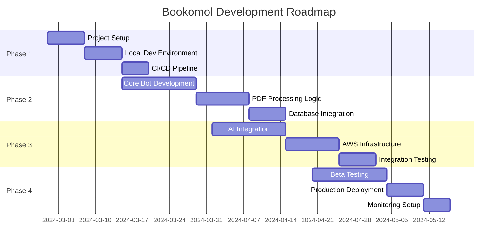
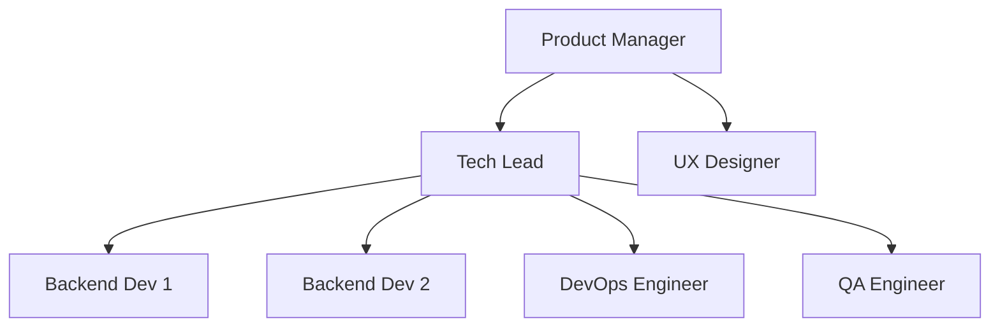

# Bookomol - PDF Book Condensing Telegram Bot
## Project Roadmap

### 1. Executive Summary

This roadmap outlines the development plan for Bookomol, from initial setup to production deployment. The project is structured in 4 major phases over approximately 12-14 weeks, with clear milestones and deliverables for each phase.

### 2. Project Timeline Overview

### 3. Development Phases

## Phase 1: Foundation & Setup (Weeks 1-2)

### Objectives
- Establish development environment
- Setup project structure and tooling
- Implement CI/CD pipeline
- Create initial documentation

### Deliverables

#### Week 1: Project Foundation
- [ ] Initialize Node.js project with TypeScript
- [ ] Configure ESLint, Prettier, and Husky
- [ ] Setup Vite build configuration
- [ ] Create project directory structure
- [ ] Setup Git repository with branching strategy
- [ ] Configure Docker and Docker Compose for local development
- [ ] Setup PostgreSQL and MinIO containers

#### Week 2: Development Infrastructure
- [ ] Implement GitHub Actions CI pipeline
- [ ] Setup automated testing framework (Jest)
- [ ] Configure Pulumi project for IaC
- [ ] Create development environment configuration
- [ ] Setup logging infrastructure (Pino)
- [ ] Implement basic error handling patterns
- [ ] Create initial database migrations

### Success Criteria
- Local development environment runs successfully
- All developers can run `npm run dev` without issues
- CI pipeline passes on all commits
- Database migrations execute cleanly

### Resources Required
- 2 Backend Developers
- 1 DevOps Engineer (part-time)

---

## Phase 2: Core Development (Weeks 3-5)

### Objectives
- Implement Telegram bot functionality
- Build PDF processing pipeline
- Integrate database operations
- Create basic user workflows

### Deliverables

#### Week 3: Telegram Bot Development
- [ ] Setup Telegraf bot framework
- [ ] Implement webhook handling
- [ ] Create command handlers (/start, /condense, /help, etc.)
- [ ] Implement conversation flow management
- [ ] Add user registration logic
- [ ] Create inline keyboard interfaces
- [ ] Implement error handling for bot

#### Week 4: PDF Processing Pipeline
- [ ] Implement PDF upload handling
- [ ] Create S3 integration for file storage
- [ ] Build PDF validation logic
- [ ] Implement basic PDF splitting (mock AI)
- [ ] Create chapter processing workflow
- [ ] Implement PDF assembly logic
- [ ] Add progress tracking system

#### Week 5: Database & Queue Integration
- [ ] Implement Sequelize models
- [ ] Create repository pattern for data access
- [ ] Implement user quota management
- [ ] Setup SQS queue handling
- [ ] Create job status tracking
- [ ] Implement notification system
- [ ] Add comprehensive logging

### Success Criteria
- Bot responds to all commands correctly
- Files upload successfully to S3
- Database tracks all operations
- End-to-end flow works with mock AI

### Resources Required
- 2 Backend Developers (full-time)
- 1 QA Engineer (part-time)

---

## Phase 3: AI Integration & AWS Setup (Weeks 6-8)

### Objectives
- Integrate Google Gemini AI
- Deploy to AWS infrastructure
- Implement production features
- Setup monitoring and alerting

### Deliverables

#### Week 6: AI Integration
- [ ] Setup Google Gemini SDK
- [ ] Implement chapter detection prompts
- [ ] Create content condensation logic
- [ ] Build intelligent chapter filtering
- [ ] Optimize prompts for different book types
- [ ] Implement retry logic for AI calls
- [ ] Add AI response validation

#### Week 7: AWS Infrastructure Deployment
- [ ] Deploy Lambda functions using Pulumi
- [ ] Configure API Gateway
- [ ] Setup RDS PostgreSQL instance
- [ ] Configure S3 buckets with lifecycle policies
- [ ] Setup SQS queues
- [ ] Implement IAM roles and policies
- [ ] Configure VPC and security groups

#### Week 8: Production Features
- [ ] Implement rate limiting
- [ ] Add request validation
- [ ] Setup CloudWatch monitoring
- [ ] Configure alerts and notifications
- [ ] Implement graceful error recovery
- [ ] Add performance optimizations
- [ ] Setup log aggregation

### Success Criteria
- All Lambda functions deploy successfully
- AI processing works reliably
- System handles errors gracefully
- Monitoring dashboards show key metrics

### Resources Required
- 2 Backend Developers
- 1 DevOps Engineer
- 1 AI/ML Engineer (consulting)

---

## Phase 4: Testing & Production Launch (Weeks 9-12)

### Objectives
- Conduct thorough testing
- Deploy to production
- Setup operational procedures
- Launch beta program

### Deliverables

#### Week 9-10: Testing Phase
- [ ] Execute unit test suite (>80% coverage)
- [ ] Perform integration testing
- [ ] Conduct load testing (200 concurrent users)
- [ ] Execute security testing
- [ ] Perform user acceptance testing
- [ ] Fix identified bugs
- [ ] Optimize performance bottlenecks

#### Week 11: Production Deployment
- [ ] Deploy production infrastructure
- [ ] Migrate production database
- [ ] Configure production secrets
- [ ] Setup production monitoring
- [ ] Configure backup procedures
- [ ] Create runbooks for operations
- [ ] Implement rollback procedures

#### Week 12: Beta Launch
- [ ] Launch closed beta program
- [ ] Monitor system performance
- [ ] Collect user feedback
- [ ] Fix critical issues
- [ ] Document lessons learned
- [ ] Plan for general availability
- [ ] Create user documentation

### Success Criteria
- All tests pass with >80% coverage
- System handles 200 books/month smoothly
- Beta users successfully process books
- No critical bugs in production

### Resources Required
- 2 Backend Developers
- 1 DevOps Engineer
- 1 QA Engineer
- 5-10 Beta testers

---

### 4. Milestone Schedule

| Milestone | Date | Description | Success Criteria |
|-----------|------|-------------|------------------|
| M1: Dev Environment Ready | Week 2 | Local development fully functional | All developers can run locally |
| M2: Bot MVP Complete | Week 4 | Basic bot with mock processing | End-to-end flow demonstrated |
| M3: AI Integration Complete | Week 6 | Real AI processing working | Books condensed successfully |
| M4: AWS Deployment Ready | Week 8 | Infrastructure deployed to staging | All services running on AWS |
| M5: Beta Launch | Week 12 | System ready for beta users | 10 beta users onboarded |

### 5. Risk Management

#### High-Risk Items

| Risk | Impact | Probability | Mitigation Strategy |
|------|--------|-------------|---------------------|
| Gemini API rate limits | High | Medium | Implement caching, use multiple API keys |
| Large PDF processing timeout | High | Medium | Optimize chunking, increase Lambda limits |
| Cost overruns on AWS | Medium | Medium | Set up billing alerts, optimize resource usage |
| Complex PDFs failing | Medium | High | Implement robust error handling, manual review |

#### Dependencies

1. **External Dependencies**
   - Google Gemini API availability
   - Telegram Bot API stability
   - AWS service quotas approval

2. **Technical Dependencies**
   - PDF processing library compatibility
   - Sequelize PostgreSQL driver stability
   - Pulumi AWS provider updates

### 6. Resource Allocation

#### Team Structure

#### Time Allocation

| Role | Phase 1 | Phase 2 | Phase 3 | Phase 4 | Total |
|------|---------|---------|---------|---------|--------|
| Backend Dev 1 | 80hrs | 120hrs | 120hrs | 120hrs | 440hrs |
| Backend Dev 2 | 80hrs | 120hrs | 120hrs | 120hrs | 440hrs |
| DevOps Engineer | 40hrs | 40hrs | 80hrs | 60hrs | 220hrs |
| QA Engineer | 20hrs | 40hrs | 40hrs | 80hrs | 180hrs |
| Tech Lead | 40hrs | 60hrs | 60hrs | 60hrs | 220hrs |

### 7. Budget Estimates

#### Development Costs
- **Personnel**: $80,000 (based on hourly rates)
- **Tools & Services**: $2,000
  - GitHub Pro
  - Development tools
  - Testing services

#### Infrastructure Costs (Monthly)
- **AWS Services**: ~$150/month
  - Lambda: $25
  - S3: $5  
  - RDS: $15
  - Other services: $5
  - Gemini API: $100

- **Third-party Services**: $50/month
  - Monitoring tools
  - Error tracking

#### Total Project Cost
- **One-time Development**: $82,000
- **Ongoing Monthly**: $200/month

### 8. Success Metrics

#### Technical Metrics
- [ ] 99.5% uptime achieved
- [ ] <5 minute average processing time for 200-page book
- [ ] <2% error rate on processing
- [ ] <500ms API response time (p95)

#### Business Metrics
- [ ] 100 beta users onboarded
- [ ] 1,000 books processed in first month
- [ ] 85% user satisfaction rating
- [ ] <5% churn rate

#### Quality Metrics
- [ ] >80% code coverage
- [ ] Zero critical security vulnerabilities
- [ ] <10 bugs per thousand lines of code
- [ ] All accessibility standards met

### 9. Post-Launch Roadmap

#### Month 1-3: Stabilization
- Monitor and optimize performance
- Fix bugs based on user feedback
- Improve AI prompts based on results
- Optimize costs

#### Month 4-6: Feature Enhancement
- Add support for more file formats (EPUB, MOBI)
- Implement batch processing
- Add language detection and multilingual support
- Create premium tier features

#### Month 7-12: Expansion
- Develop web interface
- Create API for third-party integrations
- Implement advanced AI models
- Explore enterprise features

### 10. Communication Plan

#### Stakeholder Updates
- **Weekly**: Development team standup
- **Bi-weekly**: Stakeholder progress report
- **Monthly**: Executive summary

#### Documentation
- Technical documentation in repository
- User guide on website
- API documentation (when applicable)
- Operational runbooks

#### Feedback Channels
- Beta user Telegram group
- GitHub issues for bug reports
- User satisfaction surveys
- Feature request tracking

### 11. Launch Checklist

#### Pre-Launch (Week 11)
- [ ] All critical bugs resolved
- [ ] Performance benchmarks met
- [ ] Security audit completed
- [ ] Documentation finalized
- [ ] Support procedures established
- [ ] Monitoring alerts configured

#### Launch Day (Week 12)
- [ ] Production deployment verified
- [ ] Beta users notified
- [ ] Support team briefed
- [ ] Monitoring dashboard active
- [ ] Rollback plan ready
- [ ] Communication channels open

#### Post-Launch (Week 12+)
- [ ] Daily performance reviews
- [ ] User feedback collection
- [ ] Bug triage process active
- [ ] Feature request tracking
- [ ] Cost monitoring
- [ ] Scaling plan ready

### 12. Conclusion

This roadmap provides a structured approach to developing and launching Bookomol. The phased approach allows for iterative development with clear milestones and success criteria. Regular monitoring and adjustment of the plan will ensure successful delivery within the projected timeline and budget.

The key to success will be:
1. Maintaining clear communication across the team
2. Adapting quickly to technical challenges  
3. Focusing on user experience and reliability
4. Managing costs while ensuring quality
5. Building a scalable foundation for future growth